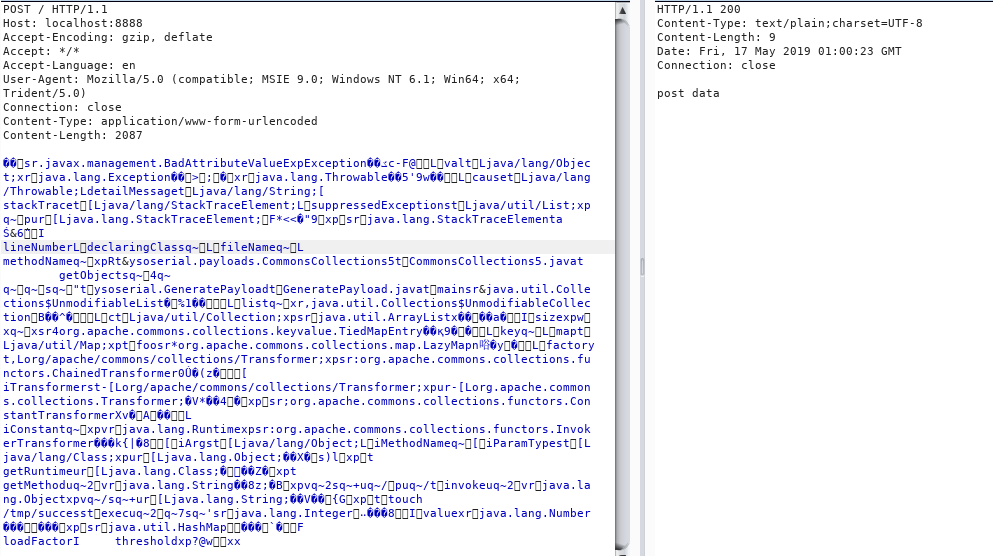
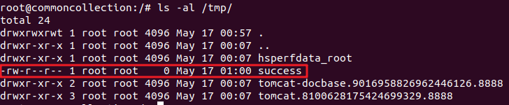

# Apache Common Collection漏洞环境以及payload测试
## 说明
Apache Common Collection反序列化是在JAVA反序列化案例中是一个非常经典的例子，对应反序列的gadget也有非常多的例子。本项目就是搭建了3.1，4.0的多个存在漏洞的版本用于演示不同的payload.所有的payload的来源均来自于ysoserial。由于采用的是openjdk8运行漏洞环境，而openjdk8的默认版本是jdk8-212部分的payload是无法成功触发的。

参考链接：
- [Commons Collections Java反序列化漏洞深入分析](https://security.tencent.com/index.php/blog/msg/97)
- [Apache Commons Collections反序列化漏洞学习](http://pirogue.org/2017/12/22/javaSerialKiller/)
- [Java反序列化之Commons-Collections](https://badcode.cc/2018/03/15/Java%E5%8F%8D%E5%BA%8F%E5%88%97%E5%8C%96%E4%B9%8BCommons-Collections/)

## 环境搭建

执行下面命令启动漏洞环境：

```
docker-compose up -d
```

稍等一会，环境启动后，访问`http://your-ip:8888`，页面出现`Hello World!`则表示搭建成功;


## 漏洞复现
### CommonsCollections1
此gadget利用`ChainedTransformer`构造出自己的漏洞利用链，然后通过jre中的`AnnotationInvocationHandler`反序列化触发payload。但是这个payload,需要JDK小于8或者是小于8U71才有效。

所以在本漏洞环境中，此payload无法使用。

### CommonsCollections2
此需要版本是`commons-collections4:4.0`,查看[]()详情

### CommonsCollections3
此gadget利用`LazyMap`构造出自己的漏洞利用链,利用动态代理的方式通过调用`AnnotationInvocationHandler`的`invoke()`触发payload，与`CommonsCollections1`所需要的漏洞环境一样，需要JDK小于8或者是小于8U71才有效。

所以在本漏洞环境中，此payload无法使用。

### CommonsCollections4
此需要版本是`commons-collections4:4.0`,查看[]()详情

### CommonsCollections5
此gadget利用`TiedMapEntry`构造出自己的漏洞利用链，利用`BadAttributeValueException`的反序列化方法执行`TiedMapEntry.toString()`，最终触发payload。

这个漏洞的触发条件
- JDK > 8u76
- commons-collections:3.1

使用如下的命令生成payload。
`java -jar ysoserial.jar CommonsCollections5 'touch /tmp/success' > CommonsCollections5.bin`

使用burp采用POST方法发送此payload。由于此payload是经过序列化的二进制文件，所以需要修改content-type为：`Content-Type: application/www-form-urlencoded`。将生成的整个文件直接作为POST的数据(burp右键选择**Paste from file**)

如果返回值出现`post data`，则表明payload已经成功被范反序列化，payload已经被执行。



`docker-compose exec commoncollection bash`登录到容器验证



### CommonsCollections6

### CommonsCollections7
